# 🌍 Carbon Tracker — The Digital Arboreal

> Track, analyze, and reduce your carbon footprint across devices and cloud infrastructure.

Carbon Tracker is a full-stack application that measures real-time energy consumption and CO₂ emissions from your local devices, then helps you offset them by routing computational workloads to low-carbon AWS regions. It spans a **React web dashboard**, a **PyQt6 desktop app** with hardware-level tracking via CodeCarbon, and a **React Native mobile app**.

---

## Table of Contents

- [Features](#features)
- [Architecture](#architecture)
- [Tech Stack](#tech-stack)
- [Screenshots](#screenshots)
<<<<<<< HEAD
=======
  - [System Design](#system-design)
  - [Web App — Authentication](#web-app--authentication)
  - [Web App — Dashboard](#web-app--dashboard)
  - [Web App — Cloud Optimization](#web-app--cloud-optimization)
  - [Web App — Reports](#web-app--reports)
  - [Desktop App (PyQt6)](#desktop-app-pyqt6)
>>>>>>> 319a830 (Final push)
- [Getting Started](#getting-started)
  - [Prerequisites](#prerequisites)
  - [Backend Setup](#backend-setup)
  - [Frontend Setup](#frontend-setup)
  - [Python Desktop App Setup](#python-desktop-app-setup)
  - [Mobile App Setup](#mobile-app-setup)
- [Environment Variables](#environment-variables)
- [How It Works](#how-it-works)
- [API Reference](#api-reference)
- [Project Structure](#project-structure)

---

## Features

### 🔬 Local Emission Tracking
- Real-time CPU/GPU energy measurement via **CodeCarbon** on the Python desktop app
- Fallback estimation using duration × power model when CodeCarbon is unavailable
- Sessions tagged with source (`codecarbon` vs `estimated`) and synced to the backend
- Mobile activity-based estimation (idle, browsing, video, gaming)

### ☁️ Cloud Carbon Optimization
- Browse AWS regions sorted by carbon intensity (gCO₂/kWh)
- Calculate potential savings before committing any workload
- Launch real EC2 instances in green regions (eu-north-1 Stockholm = 8 gCO₂/kWh, 98% renewable)
- Auto-upgrades `t2.micro → t3.micro` in newer regions where T2 is not free-tier eligible
- Simulate workloads for tracking without real infrastructure cost

### 📊 Reporting & Insights
- **Summary report**: local vs cloud emissions across configurable periods (day/week/month/year)
- **Insights**: AI-generated recommendations based on 30-day emission patterns
- **Progress**: daily emissions vs savings chart with Q3 reduction target tracking
- Environmental equivalents (trees absorbed, miles driven, phone charges)

### 🔐 Authentication
- JWT-based auth with 7-day token expiry
- Bcrypt password hashing
- Protected routes on both frontend and API

---

## Architecture

```
┌─────────────────────────────────────────────────────────┐
│                      Client Layer                        │
│                                                         │
│  React Web App        PyQt6 Desktop      React Native   │
│  (Vite + Tailwind)    (Python + CC)      (Expo)         │
└──────────────┬──────────────┬────────────────┬──────────┘
               │              │                │
               └──────────────┴────────────────┘
                              │ HTTP / REST
                              ▼
┌─────────────────────────────────────────────────────────┐
│                   Express.js Backend                     │
│                                                         │
│  /api/auth    /api/emissions    /api/reports             │
│  /api/cloud   (MongoDB via Mongoose)                    │
└──────────────────────────┬──────────────────────────────┘
                           │
               ┌───────────┴───────────┐
               ▼                       ▼
         MongoDB Atlas            AWS SDK v3
         (User, Emission,         (EC2, CloudWatch,
          CloudWorkload,           S3, STS)
          CloudRegion)
```

---

## Tech Stack

| Layer | Technology |
|---|---|
| Web Frontend | React 19, Vite 7, Tailwind CSS 4, Recharts, React Router 7 |
| Backend | Node.js, Express 5, Mongoose 7, JWT, bcryptjs |
| Database | MongoDB (local or Atlas) |
| Python Desktop | PyQt6, CodeCarbon, requests |
| Mobile | Expo 54, React Native 0.81, expo-router, react-native-svg |
| Cloud | AWS SDK v3 (EC2, CloudWatch, S3, STS) |
| Auth | JSON Web Tokens, bcryptjs |

---

## Screenshots

<<<<<<< HEAD
### Web Dashboard — Overview

The main dashboard shows live emission stats, recent tracking sessions, and environmental impact equivalents. Data auto-refreshes every 30 seconds.


**Key panels:**
- **Local Emissions** — total gCO₂ from tracked sessions
- **Energy Usage** — kWh consumed during the period
- **Cloud Savings** — gCO₂ avoided by using low-carbon regions
- **Net Emissions** — the running balance with a leaf progress bar
- **Recent Tracking Sessions** — live table with per-session breakdown, duration, energy, and source badge (CodeCarbon vs estimated)

---

### Cloud Optimization — Results

After selecting an AWS region and calculating savings, the Results tab shows the comparison and exposes launch/simulate actions.


**Key elements:**
- Region picker sorted by carbon intensity (Stockholm at 8 gCO₂/kWh shown first)
- Side-by-side local vs cloud emissions
- Reduction percentage and energy estimate
- One-click real EC2 launch or simulated workload submission

---

### Reports — Emissions Progress

The progress report tracks 30-day daily emissions against savings, with a Q3 target bar and environmental equivalents grid.

---

### Python Desktop App

The PyQt6 app handles login, starts a CodeCarbon tracking session, and exposes the same Cloud Optimization workflow in a native window with tabs for Local Tracking, Cloud Optimization, and Active Instances.

---

### Mobile App (React Native / Expo)

The mobile app provides a circular gauge for real-time CO₂ intensity, activity-type selector, and a full reports/workloads view.
=======
### System Design

**Figure 4.1 — System Architecture Diagram**

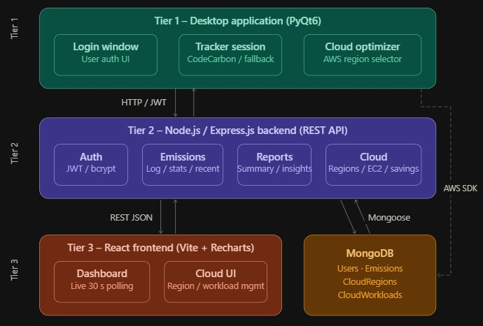

The three-tier architecture: React/PyQt6/Expo clients → Express.js REST API → MongoDB + AWS SDK.

---

**Figure 4.2 — Database Schema (ER Diagram)**

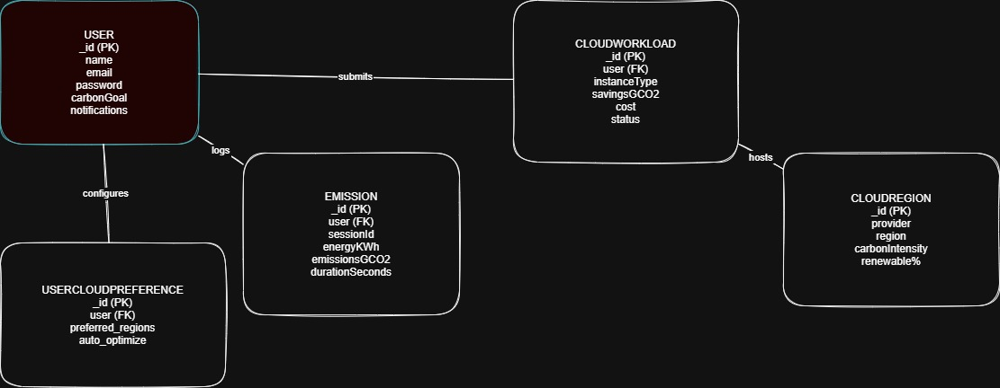

Five core collections: `User`, `Emission`, `CloudRegion`, `CloudWorkload`, and `UserCloudPreference`, with foreign-key relationships enforced through Mongoose ObjectId references.

---

**Figure 4.3 — Cloud Optimization Workflow**

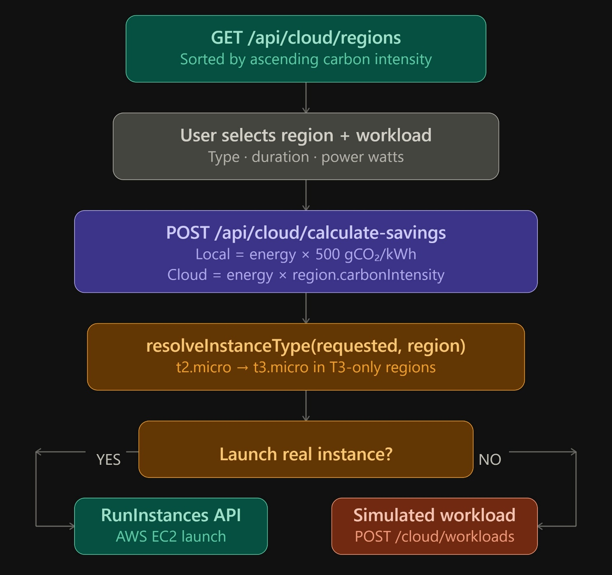

The end-to-end flow from region selection → savings calculation → EC2 launch → workload recording → dashboard display.

---

### Web App — Authentication

**Figure 5.1 — Signup Screen**

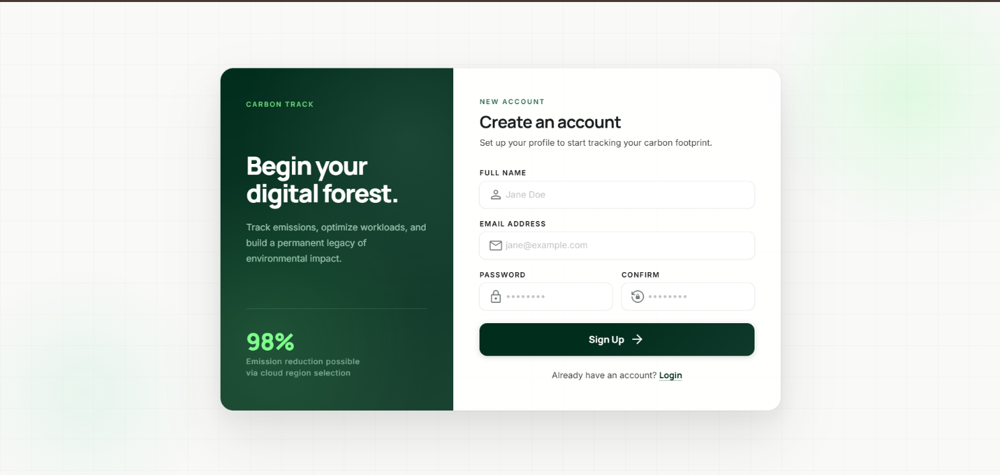

Two-column editorial layout: dark forest-green left panel with brand stats, white form panel on the right. Includes real-time password strength indicator (Weak / Fair / Strong).

---

**Figure 5.2 — Login Screen**

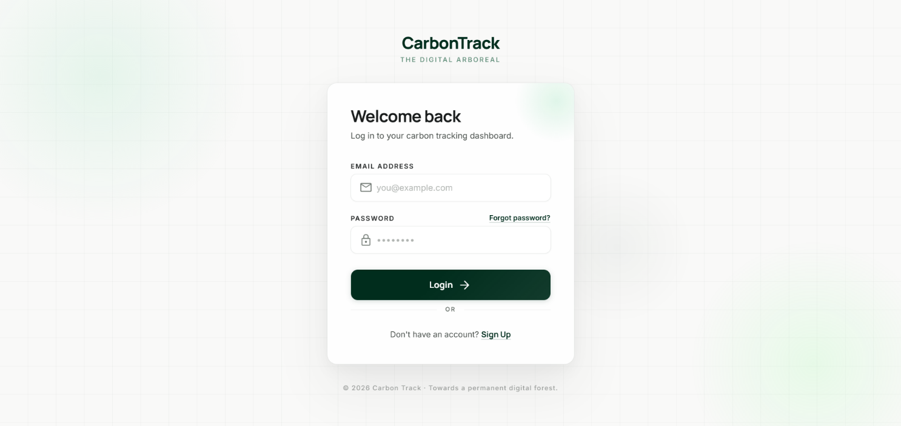

Glassmorphism card with ambient gradient blobs. Email + password fields with Material Symbols icons, JWT token stored to `localStorage` on success.

---

### Web App — Dashboard

**Figure 5.3 — Dashboard Overview**


The main dashboard with four KPI cards (Local Emissions, Energy Usage, Cloud Savings, Net Emissions), a live-refreshing recent sessions table showing per-session CO₂, energy, duration, and CodeCarbon vs estimated source badge, and the Environmental Impact equivalents panel (trees, miles, phone charges). Data auto-refreshes every 30 seconds; new rows are highlighted for 4 seconds.

---

### Web App — Cloud Optimization

**Figure 5.4 — Cloud Optimization Interface**

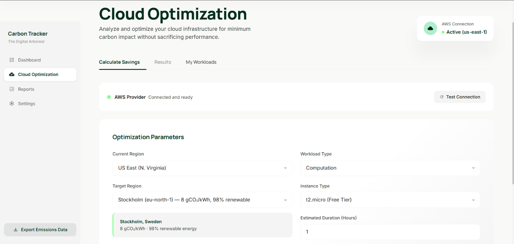

Region picker sorted by carbon intensity, workload type selector, instance type dropdown, and duration/power inputs. Greenest region (Stockholm, 8 gCO₂/kWh, 98% renewable) is pre-selected. AWS connection status widget in the top-right corner.

---

**Figure 5.5 — Carbon Savings Calculation Results**

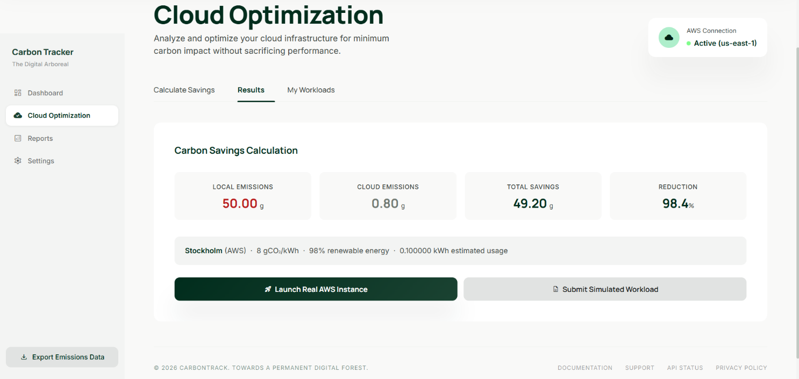

Results tab showing the four-cell breakdown: Local Emissions vs Cloud Emissions vs Total Savings vs Reduction percentage, with region detail card and dual-action row (Launch Real AWS Instance / Submit Simulated Workload).

---

### Web App — Reports

**Figure 5.6 — Reports Summary View**

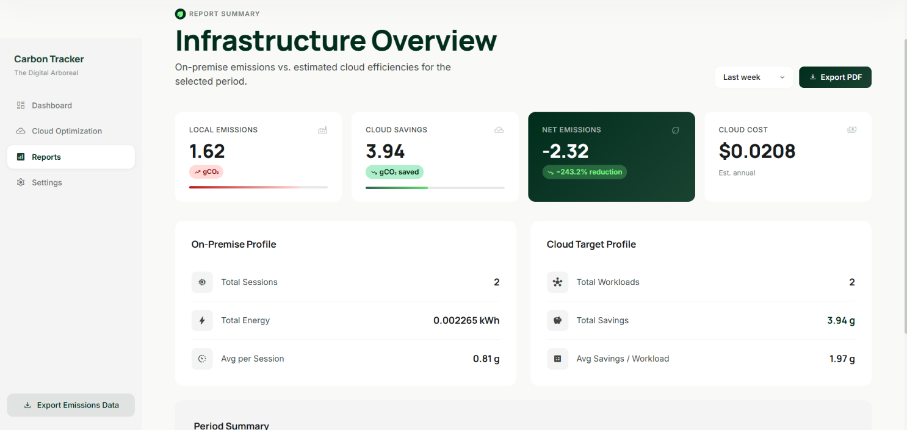

Period-selectable (day/week/month/year) overview of on-premise vs cloud emissions. Includes a highlighted Net Emissions stat card, two-column On-Premise and Cloud Target profile panels, and a period narrative summary.

---

**Figure 5.7 — AI-Powered Insights**

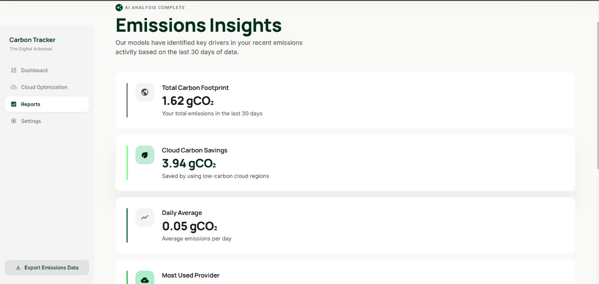

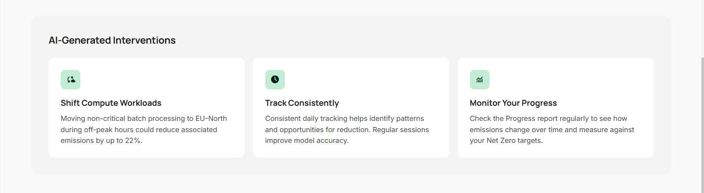

Insight cards generated from 30-day aggregated data: Total Carbon Footprint, Cloud Carbon Savings, Daily Average, and Most Used Provider. Each card uses accent-colour coding (green for savings, red for high-emission trends). Three static AI-generated intervention recommendations at the bottom.

---

**Figure 5.8 — Progress Tracking Table**

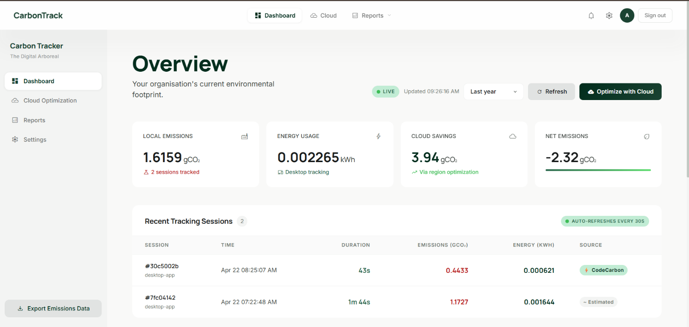

30-day daily breakdown table with Emissions, Savings, Net columns, and Q3 reduction target progress bar. Environmental equivalents grid (tree seedlings, miles driven, smartphone charges).

---

### Desktop App (PyQt6)

**Figure 5.9 — Desktop Application — Login**

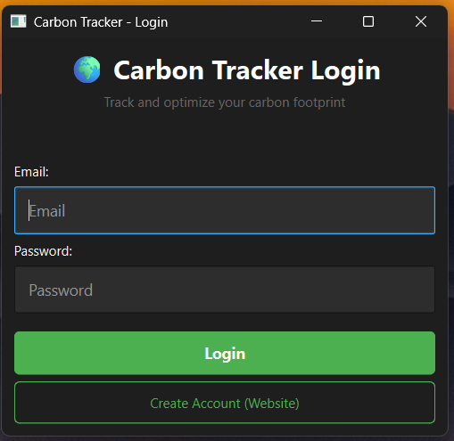

Native PyQt6 login window. Email + password fields with a login button and a link that opens the web dashboard in the browser for registration.

---

**Figure 5.10 — Desktop Application — Tracking**

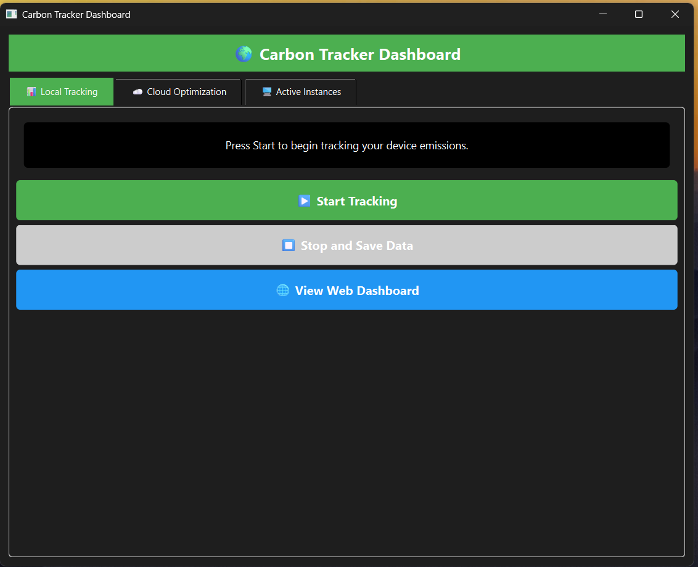

The Tracker tab after a session. Shows energy consumed (kWh), CO₂ emitted (gCO₂), and session duration. Start/Stop buttons toggle CodeCarbon measurement. The View Web Dashboard button opens the browser.

---

**Figure 5.11 — AWS Instance Launch Confirmation**

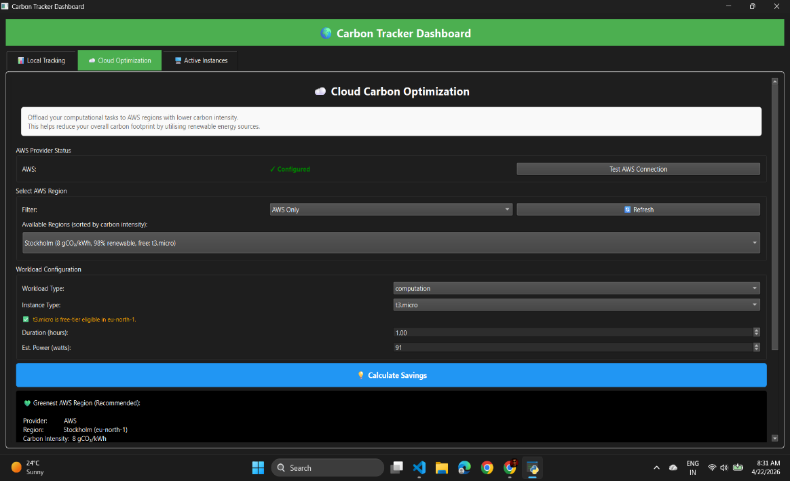

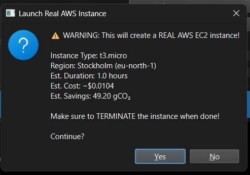

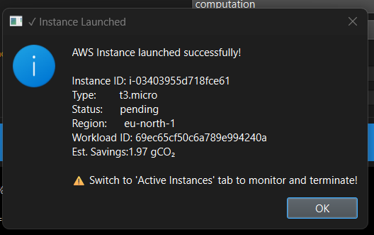

The Cloud Optimization tab in the desktop app: region dropdown with carbon intensity info, savings calculation results, and the launch confirmation dialog warning about real AWS costs.

---

**Figure 5.12 — Active Instances Management**

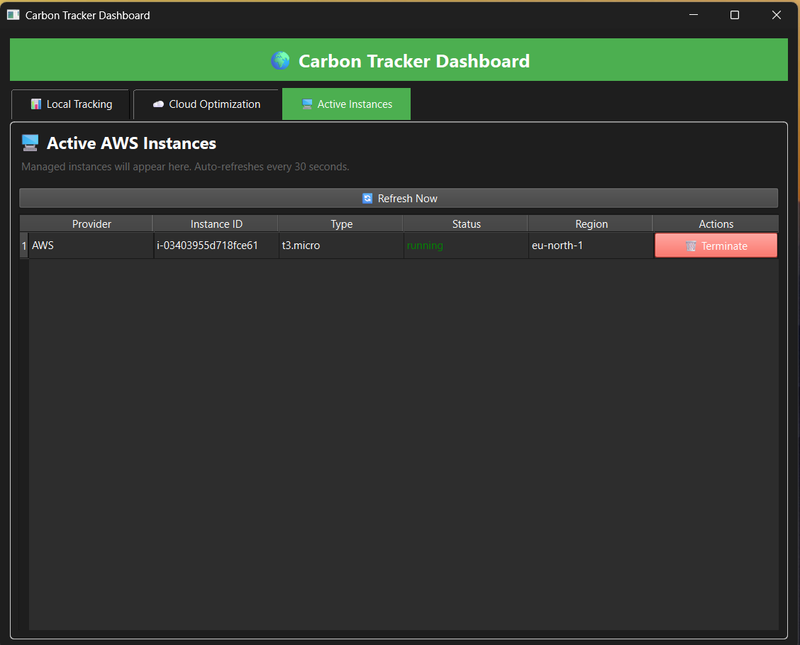

The Active Instances tab listing running EC2 instances across all monitored regions with Provider, Instance ID, Type, Status, Region columns, and per-row Terminate buttons.

---

**Figure 5.13 — API Response Times**

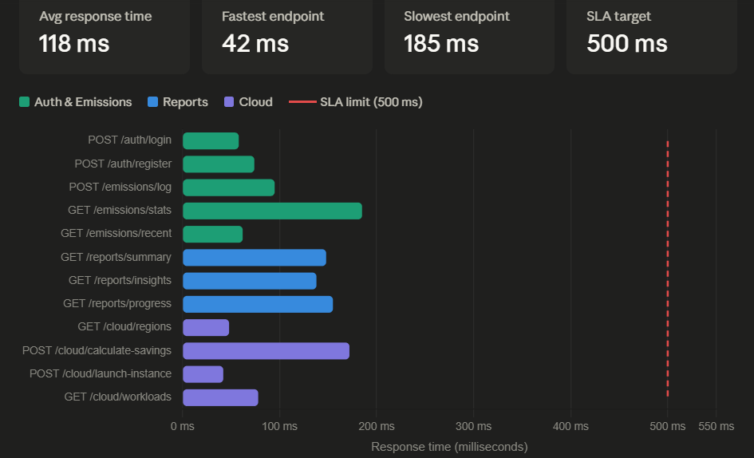

Performance benchmarks for key API endpoints demonstrating sub-200ms response times under normal load.
>>>>>>> 319a830 (Final push)

---

## Getting Started

### Prerequisites

- **Node.js** ≥ 18
- **Python** ≥ 3.10
- **MongoDB** running locally on port 27017, or a MongoDB Atlas URI
- **AWS account** with an IAM user that has `ec2:*` permissions (optional — required only for real instance launches)

---

### Backend Setup

```bash
cd web_app/backend
npm install

# Create your .env file
cp .env.example .env
```

Edit `web_app/backend/.env`:

```env
PORT=5000
MONGODB_URI=mongodb://localhost:27017/carbon-tracker
JWT_SECRET=your-super-secret-jwt-key-change-this

# Optional — only needed for real AWS launches
ENABLE_CLOUD_INTEGRATION=true
AWS_ACCESS_KEY_ID=your-access-key
AWS_SECRET_ACCESS_KEY=your-secret-key
AWS_REGION=us-east-1
```

Start the server:

```bash
npm run dev        # development (nodemon)
npm start          # production
```

The API will be available at `http://localhost:5000`. Visit `http://localhost:5000/health` to confirm it is running.

**Seed cloud regions** (required before using Cloud Optimization):

```bash
curl -X POST http://localhost:5000/api/cloud/regions/seed
```

<<<<<<< HEAD
This inserts 10 AWS regions (plus 2 GCP/Azure reference entries) sorted by carbon intensity.
=======
This inserts 10 AWS regions sorted by carbon intensity.
>>>>>>> 319a830 (Final push)

---

### Frontend Setup

```bash
cd web_app/frontend
npm install

cp .env.example .env
```

Edit `web_app/frontend/.env`:

```env
VITE_API_URL=http://localhost:5000/api
```

Start the dev server:

```bash
npm run dev        # http://localhost:3000
```

The Vite config proxies all `/api` requests to port 5000, so no CORS issues in development.

---

### Python Desktop App Setup

```bash
cd python_app
python -m venv venv
source venv/bin/activate    # Windows: venv\Scripts\activate

<<<<<<< HEAD
pip install -r requirements.txt
```

`requirements.txt` should include:

```
PyQt6
requests
python-dotenv
codecarbon
boto3
=======
pip install PyQt6 requests python-dotenv codecarbon boto3
>>>>>>> 319a830 (Final push)
```

Create `python_app/.env`:

```env
BACKEND_URL=http://localhost:5000/api
DASHBOARD_URL=http://localhost:3000
ENABLE_CLOUD_FEATURES=true

# Only needed for real AWS instance launches
AWS_ACCESS_KEY_ID=your-access-key
AWS_SECRET_ACCESS_KEY=your-secret-key
AWS_REGION=us-east-1
```

Run the app:

```bash
python app.py
```

<<<<<<< HEAD
Log in with the same credentials you registered via the web frontend. The app will show three tabs: Local Tracking, Cloud Optimization, and Active Instances (when cloud features are enabled).
=======
Log in with the same credentials you registered via the web frontend.
>>>>>>> 319a830 (Final push)

**Test your AWS setup** (optional):

```bash
python test_cloud_integration.py
```

---

### Mobile App Setup

```bash
cd mobile_app
npm install
```

<<<<<<< HEAD
Edit `mobile_app/src/services/api.js` and set `BASE_URL` to your machine's local IP (not `localhost` — the phone needs to reach your computer on the network):
=======
Edit `mobile_app/src/services/api.js` and set `BASE_URL` to your machine's local IP:
>>>>>>> 319a830 (Final push)

```js
const BASE_URL = 'http://192.168.1.x:5000/api';
```

Start Expo:

```bash
npx expo start
```

<<<<<<< HEAD
Scan the QR code with **Expo Go** (iOS or Android) or press `a`/`i` for emulators.
=======
Scan the QR code with **Expo Go** or press `a`/`i` for emulators.
>>>>>>> 319a830 (Final push)

---

## Environment Variables

### Backend (`web_app/backend/.env`)

| Variable | Required | Default | Description |
|---|---|---|---|
| `PORT` | No | `5000` | Server port |
| `MONGODB_URI` | Yes | — | MongoDB connection string |
| `JWT_SECRET` | Yes | — | Secret for signing JWT tokens |
| `ENABLE_CLOUD_INTEGRATION` | No | `false` | Enable AWS SDK calls |
| `AWS_ACCESS_KEY_ID` | If cloud enabled | — | AWS access key |
| `AWS_SECRET_ACCESS_KEY` | If cloud enabled | — | AWS secret key |
| `AWS_REGION` | No | `us-east-1` | Default AWS region |
| `NODE_ENV` | No | `development` | Environment name |

### Python App (`python_app/.env`)

| Variable | Required | Default | Description |
|---|---|---|---|
| `BACKEND_URL` | Yes | `http://localhost:5000/api` | Backend API base URL |
<<<<<<< HEAD
| `DASHBOARD_URL` | No | `http://localhost:3000` | Web dashboard URL (opened via browser button) |
=======
| `DASHBOARD_URL` | No | `http://localhost:3000` | Web dashboard URL |
>>>>>>> 319a830 (Final push)
| `ENABLE_CLOUD_FEATURES` | No | `false` | Show cloud tabs in the desktop app |
| `AWS_ACCESS_KEY_ID` | If cloud enabled | — | AWS access key |
| `AWS_SECRET_ACCESS_KEY` | If cloud enabled | — | AWS secret key |
| `AWS_REGION` | No | `us-east-1` | Default region |

---

## How It Works

### Emission Tracking Flow

```
Python App (CodeCarbon)
        │
        │  POST /api/emissions/log
        ▼
   Express Backend
        │
        │  Save to MongoDB (Emission collection)
        ▼
   Web Dashboard
        │
        │  GET /api/emissions/recent  (polls every 30s)
        ▼
   Live Session Table  ←── new rows highlighted for 4s
```

1. User starts a session in the PyQt6 app.
2. CodeCarbon begins hardware measurement (CPU energy via RAPL/NVML where available).
3. On stop, the app sends `energy_kwh`, `emissions_gco2`, `duration_seconds`, and `metadata.source` to the backend.
4. If CodeCarbon returns zeros (session under 15 seconds, or hardware access denied), the app falls back to `power_watts × duration / 1000 kWh × 500 gCO₂/kWh`.
5. The web dashboard polls `/api/emissions/recent` every 30 seconds and highlights newly arrived rows.

### Cloud Optimization Flow

```
User selects AWS region  →  POST /api/cloud/calculate-savings
                                   │
                            Returns: localEmissions, cloudEmissions,
                                     savingsGCO2, savingsPercentage
                                   │
         ┌─────────────────────────┴──────────────────────────┐
         │                                                     │
  POST /api/cloud/workloads               POST /api/cloud/launch-instance
  (simulated — no real AWS)               (real EC2 via AWS SDK v3)
         │                                        │
  Saves CloudWorkload                    RunInstancesCommand
  metadata.simulated=true               → instanceId returned
                                         → CloudWorkload saved (status: running)
```

**Instance type resolution**: newer AWS regions (Stockholm, Montreal, Mumbai, etc.) do not offer `t2.micro` on the free tier — they use `t3.micro`. The `cloudManager.resolveInstanceType()` function (and its Python mirror in `app.py`) automatically upgrades `t2.micro → t3.micro` in those regions and surfaces a notice to the user.

<<<<<<< HEAD
### Reporting

Three report endpoints aggregate from MongoDB:

- **`GET /api/reports/summary?period=week`** — totals for local emissions, cloud savings, net, and cost.
- **`GET /api/reports/insights`** — last 30 days: total footprint, daily average, cloud savings, most-used provider.
- **`GET /api/reports/progress`** — daily aggregation for the last 30 days, merged with cloud savings by date.

=======
>>>>>>> 319a830 (Final push)
---

## API Reference

### Auth

| Method | Path | Body | Description |
|---|---|---|---|
| POST | `/api/auth/register` | `{name, email, password}` | Register a new user |
| POST | `/api/auth/login` | `{email, password}` | Login, returns JWT |
| GET | `/api/auth/profile` | — | Get current user |
| PUT | `/api/auth/profile` | `{name?, preferences?}` | Update profile |

### Emissions

| Method | Path | Description |
|---|---|---|
| POST | `/api/emissions/log` | Log a tracking session |
| GET | `/api/emissions` | List emissions (supports `startDate`, `endDate`, `limit`) |
| GET | `/api/emissions/recent?limit=10` | Most recent N sessions |
| GET | `/api/emissions/stats?period=week` | Aggregated stats for a period |
| DELETE | `/api/emissions/:id` | Delete a session |

### Cloud

| Method | Path | Description |
|---|---|---|
| GET | `/api/cloud/test-connection/aws` | Verify AWS credentials |
| GET | `/api/cloud/regions?provider=aws` | List regions sorted by carbon intensity |
| POST | `/api/cloud/regions/seed` | Seed the database with known regions |
| POST | `/api/cloud/calculate-savings` | Calculate local vs cloud CO₂ |
| POST | `/api/cloud/launch-instance` | Launch a real EC2 instance |
| POST | `/api/cloud/terminate-instance` | Terminate an EC2 instance |
| GET | `/api/cloud/instance-status/:provider/:id` | Get instance state |
| GET | `/api/cloud/instances/:provider` | List running instances |
| POST | `/api/cloud/workloads` | Submit a (simulated) workload |
| GET | `/api/cloud/workloads` | List user's workloads |
| GET | `/api/cloud/workloads/:id` | Get workload details |

### Reports

| Method | Path | Description |
|---|---|---|
| GET | `/api/reports/summary?period=week` | Period summary |
| GET | `/api/reports/insights` | AI-style insight cards |
| GET | `/api/reports/progress` | Daily progress for last 30 days |

---

## Project Structure

```
carbon-tracker-app/
├── python_app/                  # PyQt6 desktop tracker
│   ├── app.py                   # Main window (login + tracker + cloud tabs)
│   ├── auth.py                  # Login helper
│   ├── tracker.py               # CodeCarbon session wrapper
│   ├── cloud_service.py         # REST client for cloud API
│   ├── config.py                # Env + AWS config validation
│   └── test_cloud_integration.py
│
├── web_app/
│   ├── backend/                 # Express.js API
<<<<<<< HEAD
│   │   ├── models/              # Mongoose schemas (User, Emission, CloudRegion, CloudWorkload)
=======
│   │   ├── models/              # User, Emission, CloudRegion, CloudWorkload
>>>>>>> 319a830 (Final push)
│   │   ├── routes/              # auth.js, emissions.js, reports.js, cloud.js
│   │   ├── middleware/auth.js   # JWT verification
│   │   ├── services/
│   │   │   └── cloudManager.js  # AWS SDK wrapper + instance type resolution
│   │   └── server.js
│   │
│   └── frontend/                # React + Vite web app
│       └── src/
│           ├── components/
│           │   ├── Login.jsx
│           │   ├── Signup.jsx
│           │   ├── Dashboard.jsx
│           │   ├── Navigation.jsx
│           │   ├── CloudOptimization.jsx
│           │   └── Reports/
│           │       ├── ReportSummary.jsx
│           │       ├── ReportInsights.jsx
│           │       └── ReportProgress.jsx
│           └── services/api.js  # Axios client
│
└── mobile_app/                  # Expo React Native app
    ├── src/
    │   ├── screens/             # Dashboard, Tracker, Cloud, Reports, Login, Register
    │   ├── components/UI.js     # Shared design system components
<<<<<<< HEAD
    │   ├── services/api.js      # Axios client (same endpoints)
    │   ├── context/AuthContext.js
    │   ├── navigation/AppNavigator.js
=======
    │   ├── services/api.js      # Axios client
    │   ├── context/AuthContext.js
>>>>>>> 319a830 (Final push)
    │   └── utils/theme.js       # "Earthbound Editorial" design tokens
    └── app/                     # Expo Router entry points
```

---

## Notes

- **CodeCarbon** requires admin/root access on some systems to read hardware energy counters (RAPL on Linux, NVML for NVIDIA GPUs). On macOS and Windows it falls back to software estimation automatically.
- Real AWS instance launches will incur costs. Always terminate instances from the Active Instances tab when done. The app estimates cost before you confirm.
<<<<<<< HEAD
- The `regions/seed` endpoint can be called any number of times — it drops and recreates the regions collection each time, so it is safe to re-run after schema changes.
- Carbon intensity figures (gCO₂/kWh) in the seeded data are approximate regional averages; for production use, consider integrating a live API such as Electricity Maps.

---
=======
- The `regions/seed` endpoint drops and recreates the regions collection each time — safe to re-run after schema changes.
- Carbon intensity figures (gCO₂/kWh) in the seeded data are approximate regional averages. For production use, consider integrating a live API such as Electricity Maps.

---

## License

MIT
>>>>>>> 319a830 (Final push)
